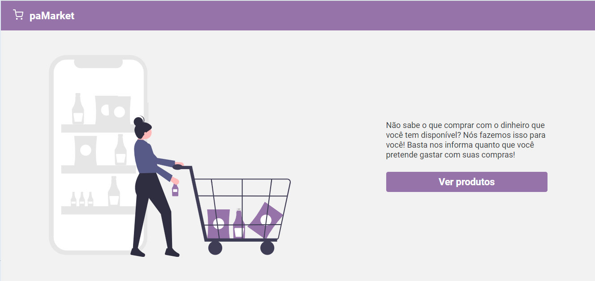
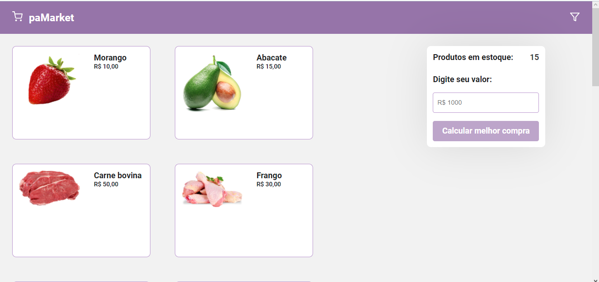
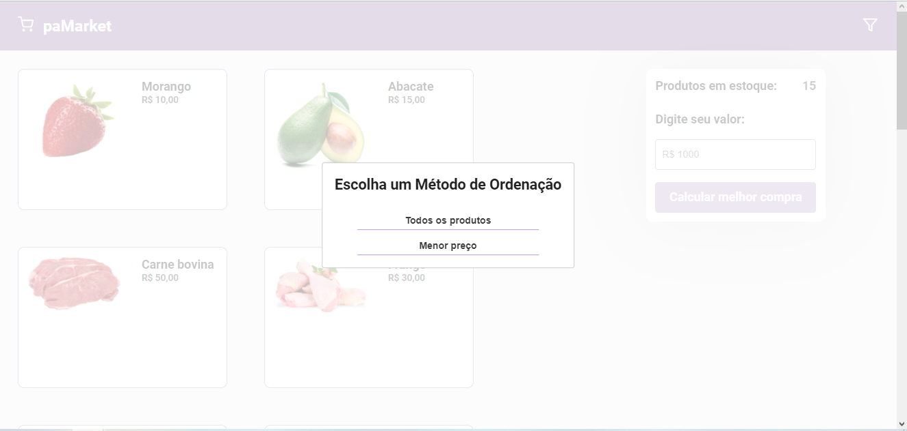
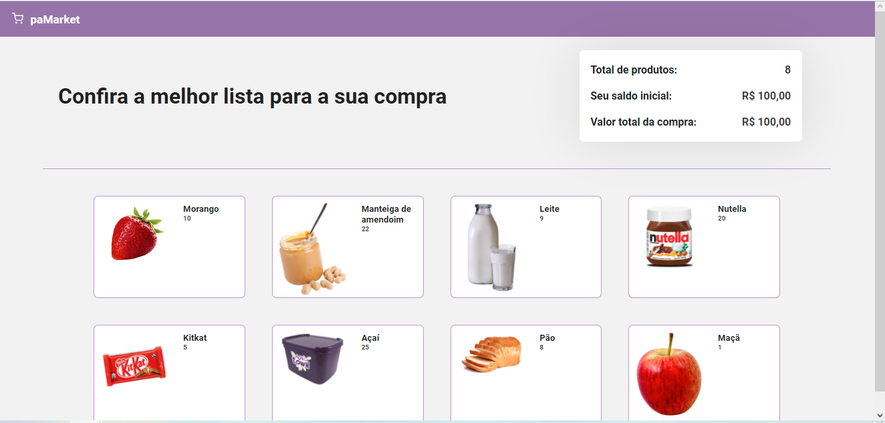

# paMarket

**Número da dupla**: 4 
**Conteúdo da Disciplina**: Programação dinâmica 

## Alunos
| Matrícula  | Aluno                         |
| ---------- | ----------------------------- |
| 18/0063723 | Fellipe dos Santos Araujo     |
| 17/0069800 | Ithalo Luiz de Azevedo Mendes |

## Apresentação
O vídeo da apresentação se encontra na pasta /media.

## Sobre 
Nesse módulo, criamos um app de mercado. Nesse app, o usuário tem alguns produtos que podem ser ordenados. Além disso, ele tem a opção de encontrar a melhor lista para sua compra, ou seja, encontrar a melhor combinação de produtos que caibam no seu orçamento.

## Screenshots

## Instalação 
**Linguagem**: Javascript 
**Framework**: ReactJS 

### Pré requisitos
- Yarn

### Comandos 
Para rodar o projeto são necessários apenas dois comandos **(que devem ser rodados na pasta museum-sort)**:
1. Para instalar todas as dependencias do projeto.
  > yarn install
2. Para executar o projeto. 
  > yarn start 

